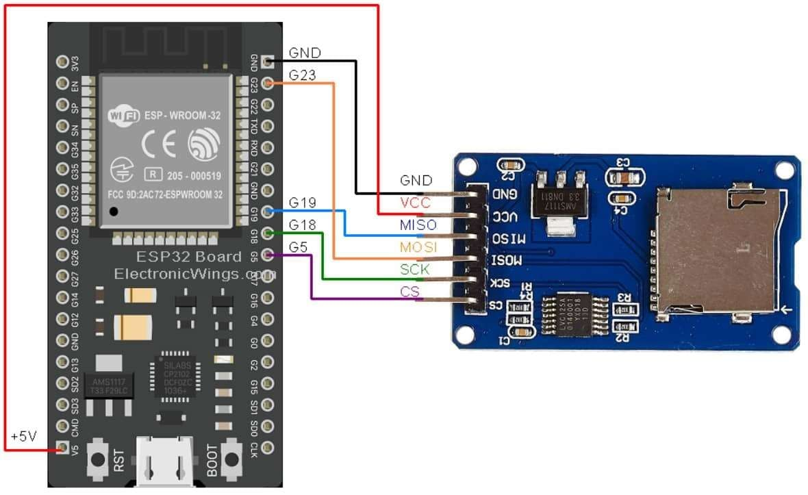

# EthHacks Esp-Terminal

Explore terminal experience with esp32 microcontrollers using EthHacks Esp-Terminal. Esp-Terminal send commands and receive responses using UART. Current Version contains sdcard and filesystem commands, Wifi commands and BlE and Classic Commands. It is a hobby-driven project and currently not in its best form, so if you want to contribute to this project, feel free to contact by mailing to 'siayam@ethhacks.net'

* Build using ESP-IDF v6
* Tested On: Esp32 Wroom
* Firmware Flashing Tool: Esptool

## Hardware Requirements

* An ESP32 board.
* USB cable - USB A / micro USB B.
* Computer running Windows, Linux, or macOS.

Note: As, most of commands requires sdcard storage so it is recommanded to attach sdcard using sdcard module to enjoy the full flavor of Esp-Terminal.
Pins currently configured for sdcard module in ESP-Terminal are as follows:

    * MISO - PIN G19
    * MOSI - PIN G23
    * SCK  - PIN G18
    * CS   - PIN G5



## Installation and Usage

* For Flashing Esp-Terminal Firmwares, use Esptool. To install Esptool, first install python in your computer. Then, to install Esptool use below command.

```
pip install esptool
```    

* After install Esptool you can use below command to flash Esp-Terminal-Firmwares:

```
python -m esptool --chip esp32 -b 460800 --before default-reset --after hard-reset write-flash --flash-mode dio --flash-size 4MB --flash-freq 40m 0x1000 Build-0/bootloader.bin 0x8000 Build-0/partition-table.bin 0x10000 Build-0/esp_terminal.bin
```   

Note: Change Baud Rate, Flash Size and Firmwares in above command according to your esp32 microcontroller variant. But make sure Esp-Terminal will not work for flash size less than 4MB.


## Firmwares Builds Information

* Build-0: It contains support to only system and sdcard commands.
* Build-1: It contains support to system, sdcard, wifi and Http/Network commands.
* Build-2: It contains support to system, sdcard and BLE commands.
* Build-3: It contains support to system, sdcard and Classic Bluetooth commands.

## Commands

The [commands.pdf](https://github.com/Ethhacks-official/EthHacks-Esp-Terminal/blob/master/commands/commands.pdf) file contains all commands with their parameters, usage and output response.

## LICENSE

This project is licensed under the GNU LESSER GENERAL PUBLIC LICENSE Version 2.1 - see the [LICENSE] file for details.

## Contact info and Links

* siayam@ethhacks.net
* Website: ethhacks.net
* Youtube: https://www.youtube.com/@EthHacks-official